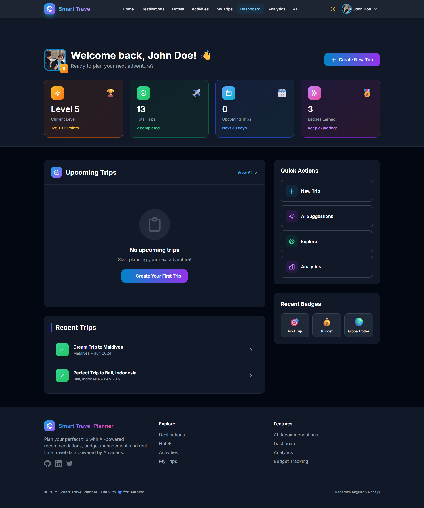
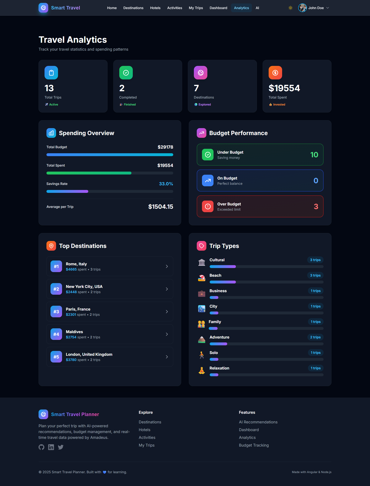
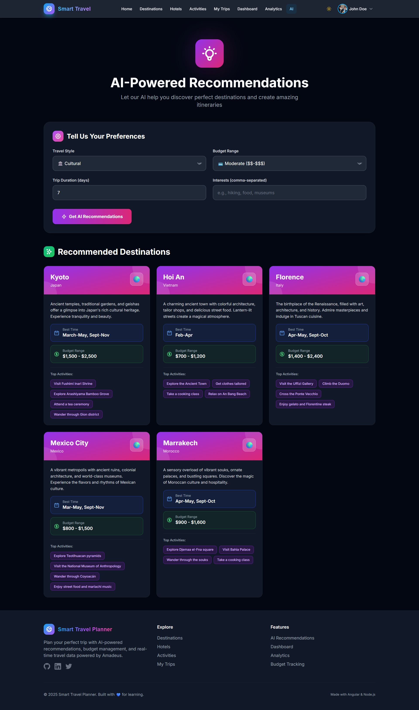
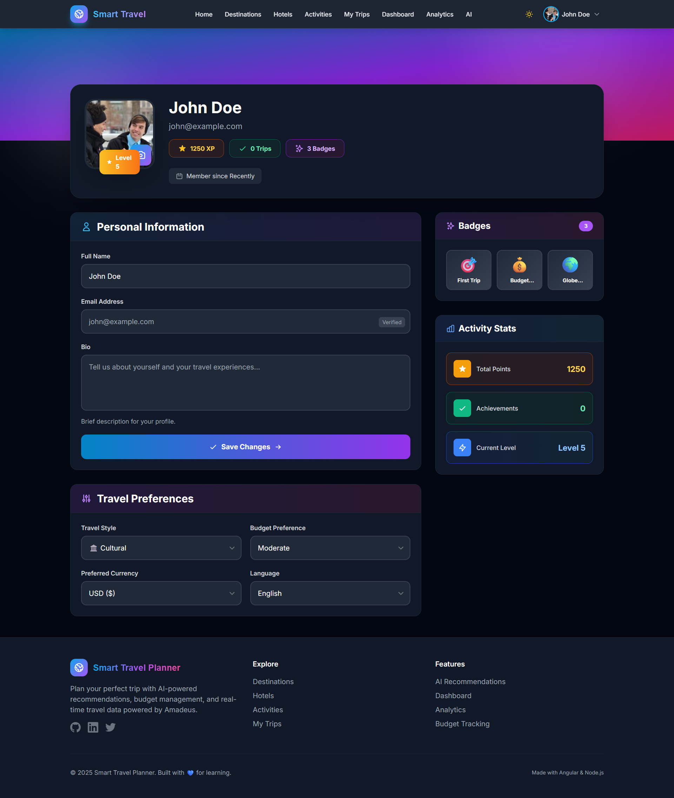

# 🌍 TripSphere (Smart Travel Planner)

A full-stack travel planning application with AI recommendations, real-time data, and collaborative features.

   

## ✨ Features

- 🗺️ **Destination Discovery** - Browse and search destinations worldwide with real-time data
- 🏨 **Hotel & Activity Search** - Find hotels and activities with live availability
- 📅 **Trip Planning** - Create detailed itineraries with day-by-day planning
- 💰 **Budget Tracking** - Manage expenses and track spending by category
- 🤖 **AI Recommendations** - Get personalized suggestions powered by Google Gemini
- 📊 **Analytics Dashboard** - Visualize travel stats and spending patterns
- 🌙 **Dark Mode** - Full dark theme support
- 📱 **Responsive** - Works seamlessly on mobile, tablet, and desktop

## 🚀 Tech Stack

**Frontend:** Angular 18, Tailwind CSS, RxJS  
**Backend:** Node.js, Express, MongoDB, Socket.IO  
**APIs:** Google Gemini AI, OpenWeather, Travel data integration  
**Auth:** JWT, Passport.js, Google OAuth

## 📋 Prerequisites

- Node.js 20+
- MongoDB Atlas account
- Google Cloud Console (OAuth & Gemini API)
- OpenWeather API key

## 🛠️ Installation

Clone repository
git clone https://github.com/yourusername/smart-travel-planner.git
cd smart-travel-planner

Backend setup
cd server
npm install
cp .env.example .env # Add your credentials

Frontend setup
cd ../client
npm install

Run both servers
Terminal 1 - Backend
cd server && npm run dev

Terminal 2 - Frontend
cd client && ng serve

text

Visit `http://localhost:4200`

## 📁 Project Structure

├── client/ # Angular 18 Frontend
│ ├── src/app/
│ │ ├── components/
│ │ ├── pages/
│ │ ├── services/
│ │ └── models/
│ └── tailwind.config.js
│
└── server/ # Node.js Backend
├── src/
│ ├── controllers/
│ ├── models/
│ ├── routes/
│ ├── services/
│ └── middleware/
└── server.js

text

## 🔑 Environment Variables

See `.env.example` for required variables:
- MongoDB connection string
- JWT secret
- Google OAuth credentials
- Gemini API key
- Weather API key

## 📸 Screenshots

### Home Page

*Modern landing page with hero section and featured destinations*

### Destinations Browser

*Browse destinations with filters, search, and real-time data toggle*

### Trip Dashboard

*Comprehensive dashboard with trip overview and statistics*

### Analytics

*Visualize travel data with interactive charts and insights*

### AI Recommendations

*Get personalized travel suggestions powered by AI*

### User Profile

*Manage your profile, trips, and preferences*

---

## 👨‍💻 Author

**Pankaj Mehra**
- Email: mehrap673@gmail.com

**Built with 💙 for learning MEAN stack development**

⭐ Star this repo if you find it helpful!
